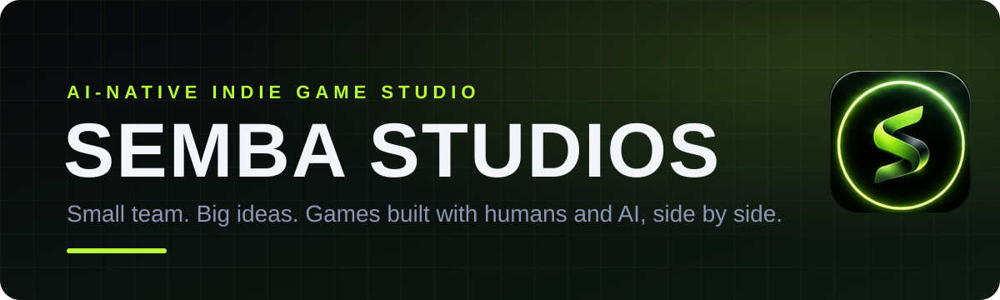
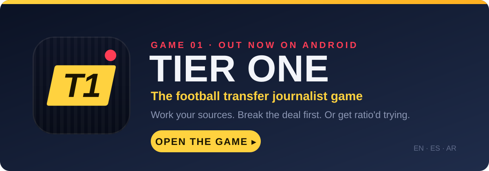

<p align="center">
  
</p>

<p align="center">
  <b>Semba Studios</b> is a small, AI-native indie game studio.<br>
  We design, write and ship games as a tiny human team working side by side with AI.
</p>

<p align="center">
  <a href="https://sembagames.app"><b>🌐 sembagames.app</b></a>: play every game free in your browser
</p>

<p align="center">
  <a href="https://sembagames.app"></a>
  <a href="#-our-games"></a>
  <a href="https://github.com/mmoustafaeditor/tier-one/raw/refs/heads/main/downloads/TierOne.apk"></a>
</p>

---

## 🎮 Our games

Play them all at **[sembagames.app](https://sembagames.app)**. Tap a game below to open its page: the story, how to play and the download.

<p align="center">
  <a href="games/tier-one">
    
  </a>
</p>

| Game | Genre | Status | Play |
|---|---|---|---|
| **[Tier One](games/tier-one)** | Football transfer-journalist strategy game | Web `v3.1.0` · Android `2.4` (classic game) | [🌐 Play](https://sembagames.app/tier-one) · [⬇️ Download APK](https://github.com/mmoustafaeditor/tier-one/raw/refs/heads/main/downloads/TierOne.apk) |
| **[The Gaffer](games/the-gaffer)** | Football manager: Europe's big five leagues + Arab leagues | Web `v2.1.0` · Android app `0.12.0` (updates itself to the latest web build) | [🌐 Play](https://sembagames.app/the-gaffer) · [⬇️ Download APK](https://github.com/mmoustafaeditor/tier-one/raw/refs/heads/main/downloads/TheGaffer.apk) |

---

## 🧠 How we build

- **Humans own the idea, taste and final call.** AI is our co-writer, co-designer and pair programmer.
- **Ship small, ship often.** Every game starts as one playable web file, then grows into an app.
- **One repo, many games.** Each game has its own folder under [`games/`](games) with its own README.
- **Everyone can see what changed.** Every update is logged in [`UPDATES.md`](UPDATES.md).

## 📁 Repository layout

```
.
├── README.md              ← you are here (studio page)
├── UPDATES.md             ← team update log: who changed what, and when
├── CLAUDE.md              ← working rules for Claude Code sessions on this repo
├── index.html             ← Semba Games studio home page (served at sembagames.app)
├── assets/                ← web-sized Semba logos used by the home page
├── tier-one/              ← Tier One v3 web build (served at sembagames.app/tier-one; built from games/tier-one/v3/web)
├── tier-one-classic/      ← Tier One classic v2 game (sembagames.app/tier-one-classic; bundled in the Android app)
├── the-gaffer/            ← The Gaffer: published web build (served at sembagames.app/the-gaffer)
├── api/tier-one/          ← Tier One Android update feed (latest.js) and v3 game API (v3/)
├── api/the-gaffer/        ← The Gaffer Android update feed, health check and purchase check
├── api/data/ · data/      ← Semba football data service shared by both games
├── api/online.js          ← online play: transfer codes, rooms, leaderboards
├── api/verify-purchase.js ← Stripe purchase check (see games/tier-one/LAUNCH.md)
├── downloads/             ← published Android APKs (TierOne.apk, TheGaffer.apk)
├── design/                ← shared Semba design tokens used by The Gaffer
├── .github/assets/        ← logos (Semba neon S, Tier One T1), banner and game card
├── .gitignore             ← keeps Android/Gradle build output out of git
├── .vercelignore          ← keeps games/, .github/, .claude/ and design/ off the public site
└── games/
    ├── the-gaffer/        ← Game 02: The Gaffer (web source, Android project, README)
    └── tier-one/          ← Game 01 page (README), launch guide, Android project (Gradle),
                              store/ (Play Store art), intro-sound/ (intro soundtrack source)
```

The web files stay where the site serves them: the home page at `/`, the games at `/tier-one` and `/the-gaffer`,
and the update feeds and APKs that installed apps poll (`/api/tier-one/latest`, `/api/the-gaffer/latest`,
`/downloads/TierOne.apk`, `/downloads/TheGaffer.apk`). The Tier One Android app bundles the classic game
(`tier-one-classic/`); The Gaffer's app downloads new web builds by itself.

## 🤝 Working on this repo

We are a three-person team (`saifsaber`, `mmoustafaeditor`, `moemsacod`) and all of us work with [Claude Code](https://claude.ai/code).
This repo is the one we all work in. The old `saifsaber/tier-one` repo is retired.
Before you start, read the latest entries in [`UPDATES.md`](UPDATES.md). After you push, add yours.
See [`CLAUDE.md`](CLAUDE.md) for the rules.

---

<div dir="rtl">

## 🇪🇬 بالعربي

**Semba Studios** استوديو ألعاب مستقل صغير شغال بالذكاء الاصطناعي. إحنا فريق صغير بنصمم ونكتب وننزل ألعاب، والـ AI شغال معانا جنب بجنب.

العب كل ألعابنا ببلاش من المتصفح على **[sembagames.app](https://sembagames.app)**.

- **[Tier One](games/tier-one)**: إنت صحفي انتقالات كورة، بتكلم مصادرك وبتحاول تفرقع الخبر قبل الكل… أو تتبهدل على السوشيال.
- **[The Gaffer](games/the-gaffer)**: إنت المدير الفني، بتمسك نادي في الدوريات الخمسة الكبار أو الدوريات العربية وبتبني فريقك.

اضغط على اللعبة عشان تدخل صفحتها.

كل تحديث بيتسجل في [`UPDATES.md`](UPDATES.md) عشان كل واحد في الفريق يعرف التاني عمل إيه.

</div>

---

<p align="center"><sub>© 2026 Semba Studios · <a href="mailto:hello@sembastudios.com">hello@sembastudios.com</a></sub></p>
