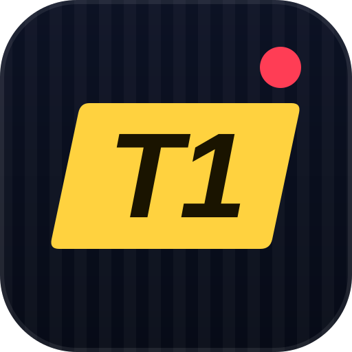

  

<h1 align="center">Tier One</h1>

<b>The football transfer journalist game.</b> 
<i>Break it first. Or get ratio'd trying.</i>

  
  
  
  

<a href="../../README.md">← Back to Semba Studios</a>

---

## 📰 The story

The window is open. 7 days. 8 sagas.

You are a football transfer journalist trying to become **Tier One**, the reporter whose word
the whole internet trusts. Eight real players are linked with eight big moves, and every
saga hides one truth:

| Outcome | What really happens |
|---|---|
| ✅ **Done deal** | He signs for the club everyone is talking about. |
| 🔀 **Hijack** | He leaves, but for somewhere else. |
| ❌ **Collapsed** | The deal falls apart. |
| 🧢 **Never real** | Someone was flying a kite. |

Your job is to find out which one it is, then post it before anyone else.
Post early and loud and you could land the exclusive. Get it wrong and the replies will tear you apart.

## 🕵️ Your sources

You get **10 contacts every day**. Premium sources cost 2 contacts and are more reliable;
budget sources cost 1 and are shakier. Every source can lie.

| Source | Cost | What they're good for |
|---|---|---|
| 🕴️ **The agent** | 📞 2 | Talks a big game. Always wants a bigger fee (and leans towards "done deal" when he lies). |
| 🩺 **The physio** | 📞 2 | If a medical is booked, they know first. |
| 🛩️ **Airport spotter** | 📞 2 | Tracks the jets. Knows the city, not the club. |
| 🧺 **The kitman** | 📞 1 | Knows if he's leaving. Never knows where. |
| 💈 **His barber** | 📞 1 | Chaotic. Occasionally pure gold. |
| 📰 **Rival newsroom leak** | 📞 1 | A friend at another paper. Decent, not perfect. |

In Career, the kitman and the physio are locked until you buy the **Press pass** and the **Medical contact**.

## 🎯 How to play

1. **Open a saga.** Read the rumor and the noise around it.
2. **Message sources.** Each clue points at a truth, or throws you off.
3. **Post your call.** Pick the outcome and how loud you say it:

   | Call | Right | Wrong |
   |---|---|---|
   | 👀 Talks ongoing | +10 | −5 |
   | 📈 Advanced stage | +20 | −15 |
   | 🔒 Confirmed | +40 | −35 |

   A correct call earns **+3 for every day before Day 7** you posted it. Beat every rival to a
   correct call and it's an **exclusive: +15**.
4. **Changing your mind** is allowed, but it's public: you lose 4–8% of your followers, the Tabloid
   mocks you, a correct re-call scores only half its base points (no early bonus, no exclusive) and a
   wrong one costs an extra 10.
5. **End the day** when you're done. Rivals post overnight and new events drop.
6. **Deadline Day.** Day 7 is a 60-second timer with only 2 contacts. Anything you haven't called scores zero.
   Then everything is announced, the replies roll in and you get your tier.

### Tiers

| Tier | Score |
|---|---|
| 🥇 **Tier 1** | 300+ |
| **Tier 2** | 200–299 |
| **Tier 3** | 110–199 |
| **Tier 4** | 45–109 |
| **Tier 5** | 0–44 |
| 🤡 **ITK Clown** | below 0 |

### Your rivals

- 🗞️ **The Tabloid** (`@BackPageBants`) posts early and loud, and is wrong more than half the time.
- 🕵️ **The ITK account** (`@TransferITK_`) is a coin flip.
- 🎙️ **The Club Insider** (`@PressBoxPete`) posts late and is nearly always right, but by then it's not an exclusive.

## 🕹️ Modes and features

- **Daily window.** The same 8 sagas for everyone, every day (Daily #1 was 25 September 2026). No gear, no boosts:
  just skill and nerve. Keep a streak going, and reopen your results after you've played.
- **Career.** Your own long game. Scores are multiplied by how big you are (×1.0 under 400 followers,
  ×1.1 under 1,500, ×1.2 under 4,000, ×1.25 above). Earn XP and credits, climb 7 levels from
  *Local blogger* to *Global insider*, and spend credits on:
  - **Gear:** Faster Wi‑Fi (+1 contact a day), Second phone (+1 more), Press pass, Medical contact.
  - **Boosts:** Burner phone (+1 contact today), Tip‑off (is the rumor real at all?), Bribe a source
    (a guaranteed true clue, with a 25% chance it leaks).
  - **Catchphrases** for your posts, from *CONFIRMED 🔒* to *TIER ONE 🥇*.
- **Practice window** that doesn't count, for learning the ropes.
- **11 achievements**, such as *Scoop king*, *Clean sheet*, *Deadline Day hero*, *Fumbled the bag* and *Flip-flopper*.
- **Skins:** Deadline night, Stadium night, Tabloid red, Broadsheet and Neon insider.
- **Three languages:** English, Spanish and Egyptian Arabic, with full right-to-left support.
- **Share cards** so you can brag about your tier, and a **save code** to move your progress to another device.

---

## 📲 Install on Android

**[⬇️ Download TierOne.apk](https://github.com/mmoustafaeditor/tier-one/raw/refs/heads/main/downloads/TierOne.apk)**

Open the file on your phone, allow **Install unknown apps** when asked, then tap **Install**.
Requires Android 7.0 or newer. If the download doesn't start from the GitHub app, open the link in your phone's browser.
The app checks for new versions by itself and offers the download when one is out.

**بالعربي:** نزّل الملف من اللينك اللي فوق وافتحه للتثبيت؛ مش محتاج فك ضغط. لو التحميل ما بدأش من تطبيق GitHub، افتح اللينك في متصفح الموبايل. محتاج Android 7.0 أو أحدث، والأبلكيشن بيقولك لوحده لما يبقى في تحديث.

---

## 🛠️ For developers

The whole game is a single web file, [`index.html`](../../index.html) at the repo root. Studio, legal, ads and
payment settings live in the `CONFIG` object at the top of its script. Hosting, ads, analytics, Stripe and the
launch checklist are covered in [`LAUNCH.md`](LAUNCH.md).

| Path | What it is |
|---|---|
| [`index.html`](../../index.html) | The entire game (HTML + CSS + JS, EN/ES/AR), served at sembagames.app |
| [`api/tier-one/latest.js`](../../api/tier-one/latest.js) | Update feed the Android app polls at `https://sembagames.app/api/tier-one/latest` |
| [`downloads/TierOne.apk`](../../downloads/TierOne.apk) | Published APK (1.1, versionCode 2) |
| [`verify-purchase.js`](../../verify-purchase.js) | Optional Stripe purchase verification |

These stay at the root because the site and installed apps load them from there.

### Android app

The APK is a WebView wrapper around the same `index.html`, with an update checker that reads the feed above.
**Its source (Gradle project + signing key) is not in this repo yet.** It still lives in the retired
`saifsaber/tier-one`. Once it is brought over it goes in this folder, with a GitHub Actions build.

### Releasing a new version

1. Update `index.html` and bump `VERSION` in its `CONFIG`.
2. Build the APK with a higher `versionCode`, signed with the same key as before, and replace `downloads/TierOne.apk`.
3. Bump `version`, `versionCode` and `changelog` in `api/tier-one/latest.js` so installed apps get prompted.
4. Update the version badge above and add an entry to [`UPDATES.md`](../../UPDATES.md).

---

Tier One is a <a href="../../README.md">Semba Studios</a> game · © 2026 · <a href="mailto:hello@sembastudios.com">hello@sembastudios.com</a>

